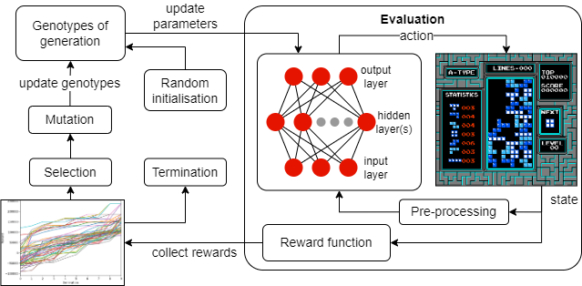

# AI Learns to play Tetris by evolution
### AE4350 Bio-inspired Intelligence and Learning

This repository contains the code used for the AE4350 assigment. In this assignment, an AI is evolved to play Tetris by use of the [`gym-tetris`](https://pypi.org/project/gym-tetris/) environemt and [`pytorch`](https://github.com/pytorch/pytorch).

## Prerequisites
- `python 3.8`
- `cudatoolkit 11.6`
- `pytorch 1.12` (cuda 11.6 version)
- `gym`
- `gym-tetris`

Note that the code can also be used without a dedicated GPU, this required changes to the code however. The included `requirements.txt` can be used to create a suitable `conda` enviromnent by entering the following into an Anaconda prompt:
```
conda create --name <env> --file requirements.txt
```
with `<env>` the name you want to give the environment.

## Perform evolution
Here's an overview of how the evolution works:

In `run_evolution.py` the following evolution parameters can be set:
| Parameter | Description |
| --- | --- |
|`run`| run ID |
|`net_type`| network type (non-CNN, CNN) |
|`net_size`| network size |
|`generations`| number of generations |
|`individuals`| number of individuals per generation |
|`indiv_best`| number of best individuals used for mutation|
|`determ_bool`|determinism of tetris game|
|`prob_mut`|mutation probatility|
|`p_mut`|mutation factor|
|`p_prep`|playfield preparation factor for tertary representation|
|`p_height_reward`| reward factor for height reward |
|`p_edge_reward`| reward factor for edgereward|
|`p_rwd2`|reward double if piece tetromino falls perfectly|
|`p_rwd_NOOP`| reward factor for no-operation action|

When running an evolution, a folder `./runs/run<ID>` is created where the generation tensors and rewards are stored.

## Evaluate an evolution
The performance of the best performing 